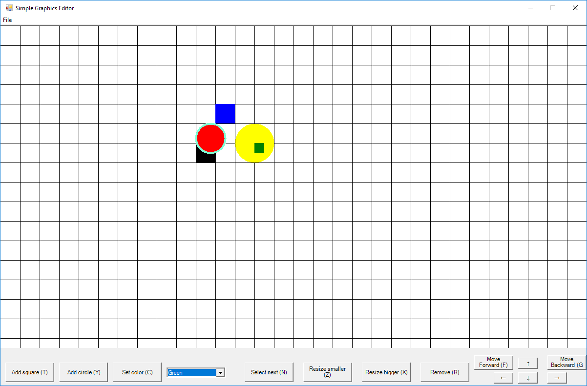
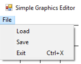

# Simple Graphics Editor
A graphics editor which can add squares and circles and position and edit them in different ways. This was developed for a project for a course in F# at Mälardalens University.

## Documentation
See "ProjektRapportDVA229_v2.pdf"

## Screenshots

